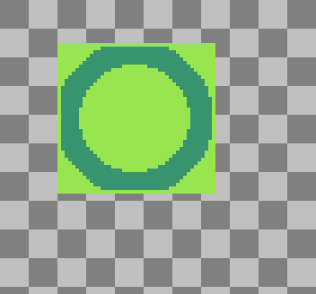

# Image

An image object. Each [cel](https://www.aseprite.org/docs/cel/) has
one image (all [linked cels](https://www.aseprite.org/docs/linked-cels/)
share the same image).

An image can be associated to a specific cel or can be alone:

* When you create an image with `Image()`, the image will be alone so
  they don't generate undo information.
* A [Cel.image](cel.md#celimage) is an image associated to a cel, some
  functions will generate undoable actions.

## Image()

```lua
local image = Image(width, height [, colorMode])
local image = Image(spec)
local image = Image(otherImage)
local image = Image{ fromFile=filename }
```

Creates a new image with the given `width` and `height`. The
[color mode](colormode.md) is optional, [RGB](colormode.md#colormodergb)
by default.

The `spec` parameter is an [image specification](imagespec.md) object.

If you specify `otherImage`, it's equivalent to use
[`otherImage:clone()`](#imageclone).

If `fromFile` is given, it indicates a file name (a string) and
it will create an image loading the first frame of the given file.

## Image:clone()

```lua
local copy = image:clone()
```

Creates a copy of the given image. You can use the `Image(otherImage)`
constructor for the same behavior.

he new image is unrelated to the sprite, but can be used to update the
image in a transaction. E.g. You clone an image, modify the pixels
from the copy, and then you [patch the image](#imageputimage).

## Image.width

```lua
local w = image.width
```

## Image.height

```lua
local h = image.height
```

## Image.colorMode

```lua
local colorMode = image.colorMode
```

Image [color mode](colormode.md).

## Image.spec

```lua
local spec = image.spec
```

The [specification](imagespec.md) for this image.

## Image.cel

```lua
local cel = image.cel
```

Returns the [cel](cel.md) to which this image belongs or `nil` if this
image is not associated to a cel.

## Image:clear()

```lua
image:clear([ color ])
```

Clear all pixels in the image with the given [color](color.md) (or
`image.spec.transparentColor` if no color is specified).

## Image:drawPixel()

```lua
image:drawPixel(x, y, color)
```

Sets the pixel in the *xy*-coordinate to the given [integer pixel
value](pixelcolor.md#apppixelcolor). The *xy*-coordinate is relative to the image,
so pixel (0, 0) is the first pixel at the top-left coorner in the
image, not in the sprite canvas.

**Warning**: This method doesn't create undo information, you should
[clone the image](#imageclone) and then [patch it](#imageputimage) to
get proper undo/redo information.

## Image:getPixel()

```lua
local pixelValue = image:getPixel(x, y)
```

Returns a [integer pixel value](pixelcolor.md#apppixelcolor) for the given
*xy*-coordinate related to the "Image" itself. The returned value will
depend on the [color mode](#imagecolormode) of the image.

Do NOT confuse with the absolute *xy*-coordinate in the Canvas.
In the following example, we show the differences between `getPixel()`,
[`Cel.bounds`](cel.md#celbounds) and [`Cel.position`](cel.md#celposition):



## Image:drawImage()

```lua
destinationImage:drawImage(sourceImage [, position ] )
```

Copies/draws the given *sourceImage* image over *destinationImage*.
If *position* is a [point](point.md), it will draw the *sourceImage*
in the given position.

**Warning**: If the image is associated with a [Cel](cel.md), this
method generates undo information, so you could use it as an
individual operation or in a [transaction](app.md#apptransaction).

## Image:drawSprite()

```lua
destinationImage:drawSprite(sourceSprite, frameNumber, [, position ] )
```

Draws the given [sourceSprite](sprite.md) frame number into the
*destinationImage*. If *position* is a [point](point.md), it will draw
the *sourceSprite* in the given position.

**Warning**: If the image is associated with a [Cel](cel.md), this
method generates undo information, so you could use it as an
individual operation or in a [transaction](app.md#apptransaction).

## Image:isEqual()

```lua
if imageA:isEqual(imageB) then
  print("Both images are equal")
end
```

Returns true if both images looks the same ([spec](#imagespec) is
equal and all [pixels](#imagepixels) are the same).

## Image:isEmpty()

```lua
local result = image:isEmpty()
```

Returns true if all pixels in the image are equal to the transparent
color.

## Image:isPlain()

```lua
local result = image:isPlain(color)
```

Returns true if all pixels in the image are equal to the given `color`
(which can be a [pixel color](pixelcolor.md#pixelcolor) or a
[color](color.md#color)).

## Image:pixels()

```lua
iterator = image:pixels()
iterator = image:pixels(rectangle)
```

Returns a pixel iterator for the whole image or the given
[rectangle](rectangle.md). Then you can use the iterator to read or
change pixel values in this way:

```lua
for it in image:pixels() do
  local pixelValue = it() -- get pixel
  it(pixelValue)          -- set pixel
  print(it.x, it.y)       -- get pixel x,y coordinates
end
```

A `pixelValue!` can be interpreted with the
[app.pixelColor](pixelcolor.md#apppixelcolor) functions.

## Image:putPixel()

Same as [Image:drawPixel()](#imagedrawpixel).

## Image:putImage()

Now it's [Image:drawImage()](#imagedrawimage).
This function is deprecated and was renamed to avoid confusion with
the behavior [cel.image](cel.md#celimage).

## Image:putSprite()

Now it's [Image:drawSprite()](#imagedrawsprite)
to match [Image:drawImage()](#imagedrawimage) name.

## Image:saveAs()

```lua
image:saveAs(filename)
```

Saves the image as a sprite in the given `filename`.
